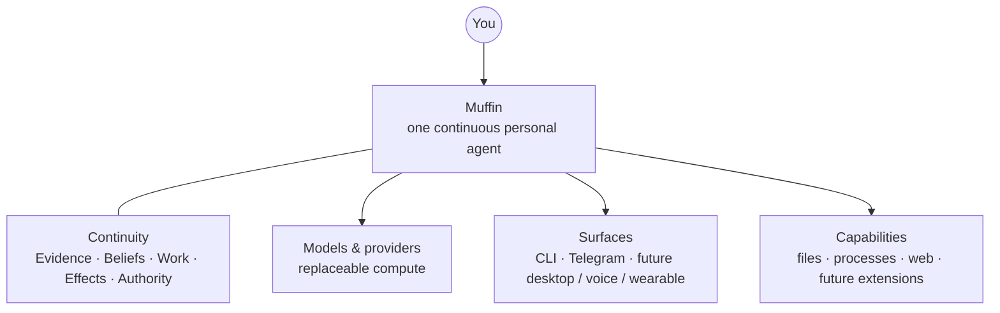

<div align="center">

# Muffin

### A personal agent built to make you more capable, not more dependent.

Muffin is an **owner-run personal agent designed around continuity**.
It keeps the thread across time, preserves what happened and what is still owed,
and acts inside authority you explicitly give it.

**One agent · your continuity · your rules**

[Why Muffin](docs/THESIS.md) · [Vision](docs/VISION.md) · [Cognitive design](docs/COGNITIVE-DESIGN.md) · [Architecture](docs/ARCHITECTURE.md) · [Security](docs/SECURITY.md)

<sub><strong>DEVELOPER PREVIEW · PRE-DAY-1</strong> — the runtime works; the product is still being hardened for real daily use.</sub>

</div>

---

> **Models change. Devices change. Apps change. Muffin should not have to become
> someone else every time they do.**

## What is Muffin?

Most AI products begin with a conversation.

Muffin begins with the **person across time**.

It is meant to be one continuous agent whose history, unfinished work, point of
view and authority survive conversations, model changes, process restarts and
new surfaces. The terminal, Telegram, a future desktop app, voice or a wearable
are ports onto the same Muffin — not separate assistants.

Memory, tools, self-hosting and messaging are rapidly becoming baseline agent
features. Muffin's bet is narrower and harder: **the quality, ownership and
portability of personal continuity**.

Continuity means more than remembering a preference. It means being able to tell:

- what actually happened;
- who said what;
- what Muffin inferred rather than observed;
- what changed over time;
- what is still unfinished;
- what may already have happened in the world;
- and what Muffin is currently allowed to do.

> **Already real:** a resident agent runtime, CLI, durable memory/work, tools,
> policy boundaries, Telegram and scheduling exist today. The current work is
> making those pieces trustworthy enough to live inside for 14 consecutive days.

[Read the thesis →](docs/THESIS.md)

## Built around the human

Muffin is not trying to simulate a human brain, and it is not designed around
maximising how much thinking a person can stop doing.

The working idea is **complementarity**: keep judgement, goals, values and the
ability to change your mind with the human; let the machine carry continuity,
tracking, comparison, follow-through and repeatable work where that actually
helps.

```text
YOU
│
├── decide what matters
├── judge
├── change your mind
└── stay able to intervene
        │
        │ works with
        ▼
MUFFIN
│
├── keeps the thread
├── remembers commitments
├── tracks change and provenance
├── compares expectation with outcome
├── follows work through
└── acts when it has authority
        │
        ▼
more capability — without giving up agency
```

That is a **product hypothesis**, not a law. Human + AI is not automatically
better. Muffin has to earn this claim in real use.

## Some unusual ideas behind Muffin

Some of these are experiments. Some are architectural boundaries. None gets to
stay merely because the story sounds clever.

| | |
|---|---|
| **Prediction → outcome → Δ**<br><sub>UNTESTED</sub><br><br>Learn from the difference between what Muffin expected and what actually happened — if we can define the prediction and measure the outcome honestly. | **Absence can be data**<br><sub>EXPERIMENT</sub><br><br>If something normally appears with a personal rhythm, its absence may be informative. That does **not** mean absence alone is a reason to interrupt. |
| **Importance ≠ frequency**<br><sub>EXPERIMENT</sub><br><br>Something repeated every day is not automatically more important than a rare event that genuinely matters. | **Forgetting can help**<br><sub>UNTESTED</sub><br><br>Discard disposable processing and stale representations while protecting the continuity humans are actually bad at carrying perfectly. |
| **Silence is an action**<br><sub>EXPERIMENT</sub><br><br>Presence is not heartbeat spam. A useful personal agent must learn when there is something specific worth saying — and when there is not. | **Understanding ≠ power**<br><sub>COMMITMENT</sub><br><br>Knowing you better can improve interpretation. It grants Muffin no additional authority by itself. |

The old Muffin already taught us an important negative lesson: a system can
notice that a topic disappeared and still be annoying or context-blind when it
asks about it. Signals are not understanding, and understanding is not a right
to interrupt.

Muffin treats cognitive science and neuroscience as **lenses for finding useful
computational problems, not blueprints to copy**. Every cognitive mechanism has
to beat a simpler baseline or lose its place.

[See the hypotheses, evidence levels and kill criteria →](docs/COGNITIVE-DESIGN.md)

## One agent, many replaceable bodies



A process can die without creating a new Muffin. A model can be replaced without
resetting the relationship. A new surface should not fork memory or authority.

The durable thing is the continuity-bearing meaning between them.

## Not just memory

Muffin currently reasons about persistent state through five semantic planes.
They are ownership boundaries, not a requirement for five databases or modules.

| Plane | The question it owns |
|---|---|
| **Evidence** | What actually entered or happened? Who/where did it come from? |
| **Beliefs** | What does Muffin currently think is true, with what uncertainty? |
| **Work** | What is still owed, waiting, due or resumable? |
| **Effects** | What did Muffin intend to do, and what may or may not have happened in the world? |
| **Authority** | Which transitions is Muffin actually allowed to perform? |

This separation matters because a transcript is not automatically a belief, a
model inference is not automatically owner speech, and a completed thought is
not the same thing as a completed real-world effect.

<details>
<summary><strong>Why bother separating these?</strong></summary>

A personal agent eventually accumulates enough history that ambiguity becomes
expensive.

If evidence and beliefs collapse together, a later inference can masquerade as a
past observation. If work and effects collapse together, a crash can turn "I was
trying to send this" into "send it again". If understanding and authority
collapse together, familiarity quietly becomes permission.

Muffin keeps those guarantees in different homes so that the model can interpret
meaning without becoming the source of authority or causality.

[Architecture →](docs/ARCHITECTURE.md)

</details>

## What it should feel like

These are **conceptual examples**, not a claim that every path below is already
shipped end-to-end. Before public alpha, examples in this section should either
be reproducible on the real product or remain explicitly labelled conceptual.

```text
A message was forwarded to Muffin.

Muffin:
"That came from someone else. You didn't say it."

                         provenance
```

```text
You:
"Wasn't this still open?"

Muffin:
"Yes. I said I'd keep following it. I'm still waiting on the dependency."

                         continuity + work
```

```text
Muffin:
"I can interpret what you probably want here.
That doesn't give me permission to send it."

                         understanding ≠ authority
```

And sometimes the right experience is simply:

```text
nothing happens
```

because elapsed time alone was not a good enough reason to bother you.

## What works today

> **Muffin is a working runtime under DAY-1 hardening, not a general-release
> personal agent yet.** The current binary question is whether the owner could
> live for 14 consecutive days using Muffin as the only general personal agent.
> Known blockers are being closed before that clock starts.

| Area | Current state |
|---|---|
| Agent runtime + CLI | **Working** · actively dogfooded during development |
| Durable memory + provenance | **Working / hardening** |
| Durable turns, waits and recovery | **Working / hardening** |
| Policy kernel, sandbox and secret boundary | **Working / hardening** |
| Telegram surface | **Working / hardening** |
| Scheduling + proactive candidates | **Working / experimental behaviour** |
| Consumer-grade installer / control app | **Planned before broad public usability** |
| Community extension catalog | **Post-DAY-1 direction** |

The detailed Gate is intentionally not duplicated here; it changes too quickly
for a public landing page to become a second status tracker.

[See the current DAY-1 inventory →](docs/blueprint/M5-BIS.md)

## Run Muffin — developer preview

The current installer is still developer-grade. Public onboarding is meant to
become substantially simpler; self-hosted should describe ownership, not an
installation punishment.

**Requirements:** Node.js 22+ and a supported model provider.

```bash
git clone https://github.com/GiustoPiedimonte/muffin-agent.git
cd muffin-agent
./install.sh
```

The installer builds Muffin, links the local command without `sudo`, then offers
to run setup.

```bash
muffin init        # configure the owner installation
muffin             # open Muffin
muffin doctor      # inspect installation/runtime health
```

On systems where `muffin` is already a foreign command (notably Linux Mint's
Cinnamon window manager), the installer deliberately uses `muffin-agent` instead
of shadowing it.

<details>
<summary><strong>Why is the repository called <code>muffin-agent</code>?</strong></summary>

The product, identity and normal command are **Muffin**. The repository/package
slug carries `-agent` because the bare npm name is unavailable and because the
rebuild had to coexist with the predecessor locally. The slug is packaging, not
product identity.

</details>

## Capabilities, not plugin sprawl

Muffin wants a narrow trusted core and broad opt-in capability at the edges.

```text
package you install
       │
       ├── capability: read mail
       ├── capability: send mail
       ├── capability: control lights
       └── capability: transform PII locally
                     │
                     ▼
              explicit grants
```

The long-term extension model separates:

- **package** — what code the owner installs;
- **capability** — each authority-bearing thing that package can do;
- **grant** — what the owner currently permits it to do.

Gmail, browser automation, Home Assistant, privacy transforms and future
messaging platforms should not all become permanent trusted core merely because
someone wants the integration.

> **What you do not install should not exist in your Muffin.**

[Extension direction →](docs/EXTENSIONS.md)

## Owner-controlled by design

Muffin is meant to act, so "self-hosted" is not enough as a security model.

Three boundaries matter especially:

1. **Meaning is not authority.** The model can interpret and propose; a
   deterministic policy boundary decides what is permitted.
2. **Known secrets stay out of the general data plane.** Normal model context,
   transcripts, logs and generic tool traffic should carry references, not
   secret values.
3. **Cloud inference is explicit egress.** If you choose a remote model provider,
   the context sent to it has left your machine. Muffin treats that as a real
   trust boundary rather than pretending "self-hosted" means "nothing leaves".

Better understanding does not silently increase power. Any future compression of
supervision has to be scoped, observable, revocable and backed by successful
history for that capability/resource/context.

[Read the security model →](docs/SECURITY.md)

## For the curious

The root README is deliberately the surface, not the encyclopedia.

<details>
<summary><strong>How is continuity supposed to survive rewrites?</strong></summary>

Muffin separates continuity-bearing meaning from derived representations and
replaceable harness.

Canonical meaning includes source evidence/provenance, identity/authority,
unfinished work and effect state needed to avoid loss or duplication. Embeddings,
indexes, summaries and caches are derived and should be rebuildable. The model,
prompts and retrieval strategies are replaceable harness.

The long-term goal is semantic portability: a future Muffin should be able to
change model, provider, device and physical storage representation without
pretending the relationship started over.

[Thesis →](docs/THESIS.md)

</details>

<details>
<summary><strong>Is Muffin "based on neuroscience"?</strong></summary>

No.

Muffin uses cognitive science and neuroscience as prior art where they expose a
real computational problem. The software mechanism still has to prove useful on
its own terms. Some current ideas are experiments; some legacy mechanisms have
already been rejected.

The project explicitly tracks external grounding separately from Muffin-specific
evidence so a good scientific story cannot promote weak software into doctrine.

[Cognitive design →](docs/COGNITIVE-DESIGN.md)

</details>

<details>
<summary><strong>Why one logical agent instead of one giant process?</strong></summary>

"One agent" is an identity/continuity property, not a deployment topology.
Today a lot can live in one resident runtime. Future browser workers, voice
workers, local model servers or remote owner-run compute may be separate
processes while still sharing one canonical continuity and policy authority.

[Architecture →](docs/ARCHITECTURE.md)

</details>

<details>
<summary><strong>What does owner-run mean?</strong></summary>

The durable personal runtime and data belong on infrastructure controlled by the
owner: desktop, home node/NAS, own VPS or a future dedicated appliance.

Central Muffin infrastructure may eventually simplify downloads, updates,
discovery, OAuth bootstrap or provisioning, but an installed Muffin should not
lose identity, memory or work because a Muffin-operated service disappears.

**Central infrastructure may simplify birth; it must not be required for life.**

</details>

## Road to open source

Muffin is still private while its foundations are cheap to change.

```text
owner DAY-1
    ↓
14 days of real daily use
    ↓
small trusted alpha
    ↓
public alpha
    ↓
community breadth + earned maintainership
```

The 14-day run is not meant to prove that Muffin has every feature. It is meant
to expose what actually forces the owner back to another general agent or direct
interface, what Muffin forgets, where it interrupts badly, and which supposedly
clever mechanisms do not help.

After DAY-1, one roadmap question dominates:

> **Which part of my digital life am I still forced to manage directly?**

And one cognitive question sits beside it:

> **Which mechanism actually made me more capable, and which one merely made
> Muffin feel more clever?**

[Open-source strategy →](docs/OPEN-SOURCE-STRATEGY.md) · [Public narrative →](docs/PUBLIC-NARRATIVE.md)

---

<div align="center">

**Muffin is not trying to win by having the longest feature list.**

It is trying to become one agent that can keep the thread of a life, do real
work, know what it does not know, and remain under the control of the person it
exists to help.

</div>
