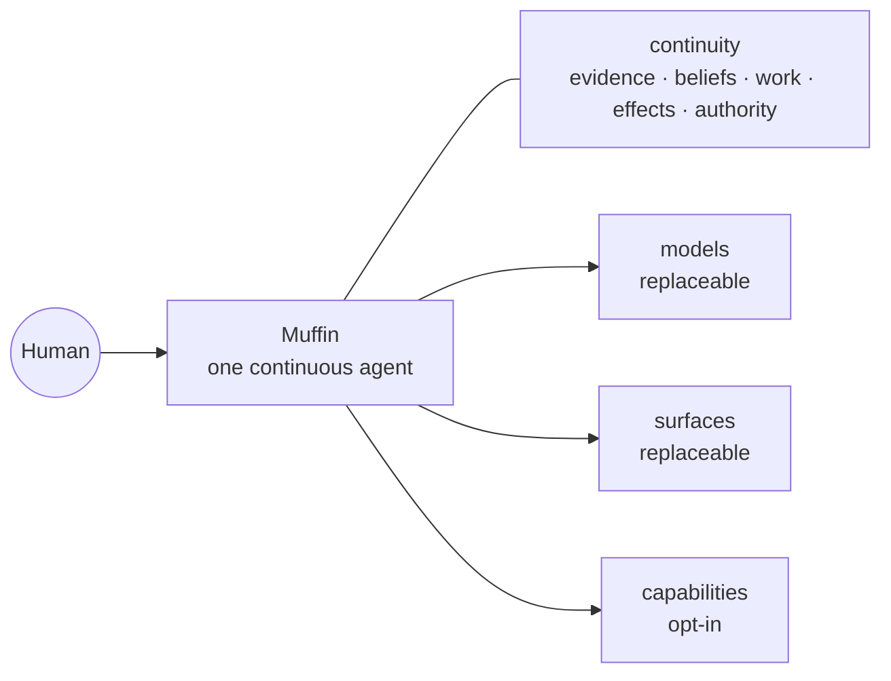

<picture>
  <source media="(prefers-color-scheme: dark)" srcset="assets/readme/banner-dark.svg">
  <source media="(prefers-color-scheme: light)" srcset="assets/readme/banner-light.svg">
  
</picture>

<div align="center">

<!--
Public README language contract (not rendered):
- README.md is the canonical authored English surface.
- README.it.md will be a derived/localized view after copy freeze, with freshness
  tracking so translations cannot silently become a second source of truth.
-->

# Muffin

### A human-first personal agent built to make you more capable, not more dependent.

One owner-run agent that keeps the thread across time, models, tools and surfaces —
while authority stays explicit and under your control.

**One agent · your continuity · your rules**

[Why Muffin](docs/THESIS.md) · [Vision](docs/VISION.md) · [Cognitive design](docs/COGNITIVE-DESIGN.md) · [Architecture](docs/ARCHITECTURE.md) · [Security](docs/SECURITY.md)

<sub><strong>DEVELOPER PREVIEW · PRE-DAY-1</strong> — the runtime works; the product is still being hardened for real daily use.</sub>

</div>

---

> **Models change. Devices change. Apps change. Muffin should not have to become
> someone else every time they do.**

## What is Muffin?

Most AI products begin with a conversation.

Muffin begins with the **person across time**.

It is meant to be one continuous personal agent whose history, unfinished work,
point of view and authority survive conversations, model changes, process
restarts and new surfaces. CLI, Telegram, future desktop, voice or a wearable
are ports onto the same Muffin — not separate assistants.

Memory, tools, self-hosting and messaging are increasingly baseline agent
features. Muffin's harder bet is **quality, ownership and portability of personal
continuity**: preserving not only facts, but who said what, what changed, what is
still owed, what may already have happened, and what the agent is allowed to do.

> **This is already a real system:** Muffin has a resident runtime, CLI, durable
> memory/work, tools, policy boundaries, Telegram and scheduling. The current job
> is making those pieces trustworthy enough to live inside for 14 consecutive
> days.

## Do · Understand · Be present

Muffin has three equal jobs.

| **DO** | **UNDERSTAND** | **BE PRESENT** |
|---|---|---|
| Carry real work through, including multi-step and long-running work. | Accumulate evidence and beliefs without flattening every source into “you said this.” | Keep the thread across sessions, waits, restarts and time — and know when silence is better. |

An executor with no continuity is a tool. A memory that cannot act is a notebook.
An assistant whose obligations disappear when the session ends is not continuous.

## Built around the human

Muffin is not trying to simulate a human brain, and it is not designed around
maximising how much thinking a person can stop doing.

The working hypothesis is **complementarity**:

```text
YOU
│
├── decide what matters
├── judge
├── change your mind
└── stay able to intervene
        │
        │ works with
        ▼
MUFFIN
│
├── keeps the thread
├── remembers commitments
├── tracks change and provenance
├── compares expectation with outcome
├── follows work through
└── acts when it has authority
        │
        ▼
more capability — without giving up agency
```

Human + AI is not automatically better. Muffin has to earn this claim in real
use. A mechanism that feels clever but does not make the owner more capable
loses its right to stay.

## Some unusual ideas we're testing

These are not scientific superpowers. Some are experiments, one is a product
commitment, and all experimental machinery is disposable.

| | |
|---|---|
| **Prediction → outcome → Δ** · `UNTESTED`<br><br>Can Muffin learn from the difference between what it expected and what actually happened — without turning a metaphor into another magic score? | **Absence can be data** · `EXPERIMENT`<br><br>If something normally appears with a personal rhythm, its absence may be informative. Absence alone is never a reason to interrupt. |
| **Importance ≠ frequency** · `EXPERIMENT`<br><br>Something repeated every day is not automatically more important than one rare event that genuinely matters. | **Forgetting can help** · `UNTESTED`<br><br>Can Muffin discard processing cruft and stale representations while preserving the continuity humans are actually bad at carrying perfectly? |
| **Silence is an action** · `EXPERIMENT`<br><br>Presence is not heartbeat spam. Timing is part of usefulness, and sometimes the right intervention is none. | **Understanding ≠ power** · `COMMITMENT`<br><br>Knowing you better can improve interpretation. It grants Muffin no additional authority by itself. |

The old Muffin already supplied negative evidence: noticing that a topic had
“disappeared” did not mean it understood why, and heartbeat prompts could become
context-blind noise. A signal is not understanding; understanding is not a right
to interrupt.

Muffin treats cognitive science and neuroscience as **lenses for finding useful
computational problems, not blueprints to copy**. External evidence and Muffin's
own product evidence are tracked separately.

[Hypotheses, evidence levels and kill criteria →](docs/COGNITIVE-DESIGN.md)

## One agent, continuous across change



A process can die without creating a new Muffin. A model can change without
resetting the relationship. A new surface should not fork memory, work or policy.

The durable thing is the continuity-bearing meaning between them.

## What it should feel like

The experience matters more than the mechanism. These examples carry explicit
maturity labels until the corresponding journey is reproducible on the real
product.

> **CURRENT INVARIANT — provenance**  
> “That came from someone else. You didn't say it.”

> **TARGET EXPERIENCE — follow-through**  
> “I said I'd keep following this. I'm still waiting on the dependency.”

> **CURRENT INVARIANT — authority**  
> “I can understand what you probably want. That does not give me permission to
> send it.”

> **EXPERIMENTAL — calibrated presence**  
> Sometimes the right experience is simply **nothing happening**, because elapsed
> time alone was not a good enough reason to bother you.

During dogfood, conceptual examples should be replaced by real, reproducible
Muffin moments wherever possible.

## What exists today

Muffin is a working runtime under **DAY-1 hardening**, not a general-release
personal agent yet. The current binary question is whether its owner could live
for 14 consecutive days using Muffin as the only general personal agent.

| Area | Current state |
|---|---|
| Agent runtime + CLI | **Working** |
| Durable memory + provenance | **Working / hardening** |
| Durable turns, waits and recovery | **Working / hardening** |
| Policy, sandbox and secret boundary | **Working / hardening** |
| Telegram | **Working / hardening** |
| Scheduling + proactive signals | **Working / experimental behaviour** |
| Consumer-grade onboarding | **Not yet** |
| Community extension catalog | **Post-DAY-1 direction** |

The detailed Gate changes too quickly to duplicate here.

[Current DAY-1 inventory →](docs/blueprint/M5-BIS.md)

## Try Muffin — developer preview

The current path is still developer-grade. Public onboarding is meant to become
substantially simpler; self-hosted should describe ownership, not an installation
punishment.

**Requirements:** Node.js 22+ and a supported model provider.

```bash
git clone https://github.com/GiustoPiedimonte/muffin-agent.git
cd muffin-agent
./install.sh
```

Then:

```bash
muffin init        # configure the owner installation
muffin             # open Muffin
muffin doctor      # inspect installation/runtime health
```

The installer does not use `sudo`. If another program already owns the `muffin`
command — notably Linux Mint's Cinnamon window manager — it installs the CLI as
`muffin-agent` instead of shadowing it.

<details>
<summary><strong>Why is the repository called <code>muffin-agent</code>?</strong></summary>

The product, identity and normal command are **Muffin**. The repository/package
slug carries `-agent` because the bare npm name is unavailable and because the
rebuild had to coexist with the predecessor locally. The slug is packaging, not
product identity.

</details>

## Go deeper

The root README is the surface, not the encyclopedia.

<details>
<summary><strong>Architecture — evidence, beliefs, work, effects and authority</strong></summary>

Muffin separates persistent meaning into five semantic planes:

- **Evidence** — what actually entered or happened;
- **Beliefs** — what Muffin currently thinks is true;
- **Work** — what is still owed, waiting, due or resumable;
- **Effects** — what Muffin intended to do and what may have happened in the world;
- **Authority** — which transitions Muffin is actually allowed to perform.

The separation keeps inference from becoming evidence, completed reasoning from
becoming a claimed real-world effect, and familiarity from becoming permission.

[Architecture →](docs/ARCHITECTURE.md)

</details>

<details>
<summary><strong>Security — meaning is not authority</strong></summary>

The model can interpret and propose. It does not grant itself authority.

Known secret values are designed to stay out of general model/transcript/tool
traffic. A configured remote model provider is explicitly treated as an egress
boundary rather than hidden behind the word “self-hosted”. Understanding the
owner better does not silently increase permissions.

[Security →](docs/SECURITY.md)

</details>

<details>
<summary><strong>Cognitive design — hypotheses, evidence and kill criteria</strong></summary>

Muffin uses cognitive science and neuroscience as prior art where they expose a
real computational problem. The software mechanism still has to prove useful on
its own terms. Some ideas are experiments; some legacy mechanisms have already
been rejected.

External scientific grounding and Muffin-specific evidence are tracked
separately. `SHIPPED` is deliberately not an evidence status.

[Cognitive design →](docs/COGNITIVE-DESIGN.md)

</details>

<details>
<summary><strong>Extensions — capabilities without growing the trusted core forever</strong></summary>

The intended extension model separates:

```text
package     what you install
capability  each authority-bearing thing it can do
grant       what you currently permit it to do
```

Gmail, browser control, Home Assistant, privacy transforms and future surfaces
should be opt-in capabilities around a narrow continuity/authority core.

> **What you do not install should not exist in your Muffin.**

[Extension direction →](docs/EXTENSIONS.md)

</details>

## Road to open source

Muffin is still private while its foundations are cheap to change.

```text
owner DAY-1
    ↓
14 days of real daily use
    ↓
small trusted alpha
    ↓
public alpha
    ↓
community breadth + earned maintainership
```

The 14-day run is meant to expose what actually forces the owner back to another
agent or direct interface, what Muffin forgets, where it interrupts badly, and
which supposedly clever mechanisms do not help.

Two questions dominate:

> **Which part of my digital life am I still forced to manage directly?**
>
> **Which mechanism actually made me more capable, and which one merely made
> Muffin feel more clever?**

[Open-source strategy →](docs/OPEN-SOURCE-STRATEGY.md) · [Public narrative →](docs/PUBLIC-NARRATIVE.md)

---

<div align="center">

**One agent. A life in context. Human in control.**

</div>
