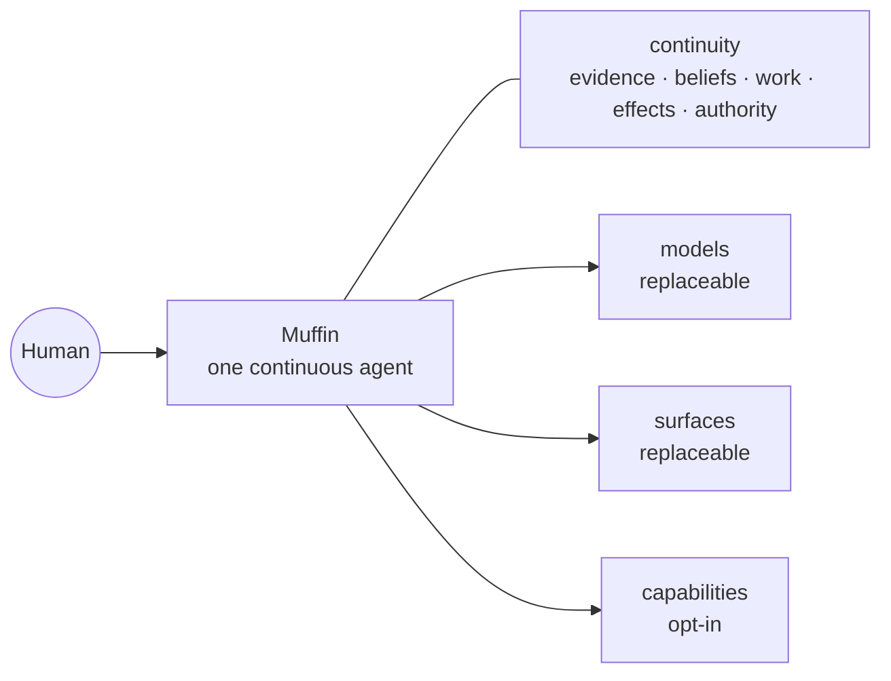

<div align="center">

<!--
Public README language contract (not rendered):
- README.md is the canonical authored English surface.
- README.it.md will be a derived/localized view after copy freeze, with freshness
  tracking so translations cannot silently become a second source of truth.
-->

# Muffin

### A human-first personal agent built to make you more capable, not more dependent.

One owner-run agent that keeps the thread across time, models, tools and surfaces —
while authority stays explicit and under your control.

**One agent · your continuity · your rules**

[Why Muffin](docs/product/THESIS.md) · [Vision](docs/product/VISION.md) · [Cognitive design](docs/product/COGNITIVE-DESIGN.md) · [Architecture](docs/architecture/ARCHITECTURE.md) · [Security](docs/architecture/SECURITY.md)

<sub><strong>SOURCE-PUBLIC · PRE-ALPHA</strong> — the code is open for inspection and contributions; the product is still being hardened for real daily use.</sub>

</div>

---

> **Models change. Devices change. Apps change. Muffin should not have to become
> someone else every time they do.**

## What is Muffin?

Most AI products begin with a conversation.

Muffin begins with the **person across time**.

It is meant to be one continuous personal agent whose history, unfinished work,
point of view and authority survive conversations, model changes, process
restarts and new surfaces. CLI, Telegram, future desktop, voice or a wearable
are ports onto the same Muffin — not separate assistants.

Memory, tools, self-hosting and messaging are increasingly baseline agent
features. Muffin's harder bet is **quality, ownership and portability of personal
continuity**: preserving not only facts, but who said what, what changed, what is
still owed, what may already have happened, and what the agent is allowed to do.

> **This is already a real system:** Muffin has a resident runtime, CLI, durable
> memory/work, tools, policy boundaries, Telegram and scheduling. The current job
> is making those pieces trustworthy enough to live inside for 14 consecutive
> days.

## Do · Understand · Be present

Muffin has three equal jobs.

| **DO** | **UNDERSTAND** | **BE PRESENT** |
|---|---|---|
| Carry real work through, including multi-step and long-running work. | Accumulate evidence and beliefs without flattening every source into “you said this.” | Keep the thread across sessions, waits, restarts and time — and know when silence is better. |

An executor with no continuity is a tool. A memory that cannot act is a notebook.
An assistant whose obligations disappear when the session ends is not continuous.

## Built around the human

Muffin is not trying to simulate a human brain, and it is not designed around
maximising how much thinking a person can stop doing.

The working hypothesis is **complementarity**:

| **You** | **Muffin** |
|---|---|
| decide what matters | keeps the thread |
| judge | remembers commitments |
| change your mind | tracks change and provenance |
| stay able to intervene | follows work through and acts inside authority |

The target is **more capability without giving up agency**. Human + AI is not
automatically better; mechanisms that do not help in real use lose their right
to stay.

## Some unusual ideas we're testing

| Idea | Status | Question |
|---|---|---|
| **Prediction → outcome → Δ** | `UNTESTED` | Can explicit prediction error improve calibration better than simply giving a strong model good history? |
| **Silence can carry signal** | `EXPERIMENT` | A human not mentioning something can matter. It does not tell Muffin why. |
| **Importance ≠ frequency** | `EXPERIMENT` | Can rare-but-important context survive without turning repetition into importance? |
| **Forgetting can help** | `UNTESTED` | Can derived cruft decay while valuable continuity survives? |
| **Timing is part of intelligence** | `EXPERIMENT` | A useful signal still may not justify interrupting the owner. |
| **Understanding ≠ power** | `COMMITMENT` | Knowing the owner better never grants authority by itself. |

These are not scientific superpowers. Cognitive science and neuroscience are
**lenses for finding useful computational problems, not blueprints to copy**.
Legacy Muffin already supplied negative evidence: a detected pattern or absence
can be real while the resulting intervention is still context-blind noise.

[Hypotheses, evidence levels and kill criteria →](docs/product/COGNITIVE-DESIGN.md)

## One agent across change



Models can change. Processes can die. New surfaces can appear. Those changes
should not create a new Muffin or fork its memory, unfinished work or authority.

## What it should feel like

| | Muffin moment |
|---|---|
| **CURRENT · provenance** | “That came from someone else. You didn't say it.” |
| **TARGET · follow-through** | “I said I'd keep following this. I'm still waiting on the dependency.” |
| **CURRENT · authority** | “I understand what you probably want. That doesn't give me permission to send it.” |
| **EXPERIMENTAL · presence** | A signal can be interesting and Muffin can still decide not to interrupt. |

During dogfood, conceptual examples should progressively give way to real,
reproducible moments.

## What exists today

Muffin is a working runtime under **DAY-1 hardening**, not a general-release
personal agent yet.

| Area | State |
|---|---|
| Runtime + CLI | **Working** |
| Memory + provenance | **Working / hardening** |
| Durable work + recovery | **Working / hardening** |
| Policy, sandbox + secret boundary | **Working / hardening** |
| Telegram | **Working / hardening** |
| Scheduling + proactive signals | **Working / experimental** |
| Consumer onboarding | **Not yet** |

The detailed DAY-1 state moves too quickly to duplicate here. Start with the
short status router, then follow it to the requirement-level evidence only when
you need it.

[Current status and release boundaries →](docs/STATUS.md)

## Try Muffin — developer preview

**Requirements:** a Linux or macOS machine, and a supported model provider.
Node is not one: the installer brings its own if the machine has none.

```bash
curl -fsSL https://raw.githubusercontent.com/muffin-project/muffin-agent/main/bootstrap.sh | sh
```

One command, from an empty box into first-run setup: the tiny bootstrap stages
the canonical installer and preserves the controlling terminal even though the
public command itself is a pipe. The installer brings Node 22 when needed,
clones and builds the source, puts `muffin` on your `PATH`, hands directly into
the masked setup flow, and installs the gateway as a supervised service where
the platform supports it. Secrets never travel through argv or the generic
environment. Updates and rollbacks go through the same path afterwards:

```bash
muffin update              # a release built alongside, then an atomic swap
muffin update --rollback   # the inverse flip
```

From a clone instead — `git clone …` then `./install.sh` — if you would rather
read the canonical installer before running it.

[What the installer does, and how to undo it →](docs/user/INSTALL.md)

<details>
<summary><strong>Architecture — evidence, beliefs, work, effects and authority</strong></summary>

Muffin separates persistent meaning into five semantic planes:

- **Evidence** — what entered or actually happened;
- **Beliefs** — what Muffin currently thinks is true;
- **Work** — what is still owed, waiting, due or resumable;
- **Effects** — what Muffin intended and what may have happened in the world;
- **Authority** — which transitions Muffin may perform.

[Architecture →](docs/architecture/ARCHITECTURE.md)

</details>

<details>
<summary><strong>Security — meaning is not authority</strong></summary>

The model can interpret and propose. It does not grant itself authority. Known
secret values are designed to stay out of normal model, transcript and tool
traffic, and a remote model provider is treated explicitly as an egress boundary.

[Security →](docs/architecture/SECURITY.md)

</details>

<details>
<summary><strong>Cognitive design — hypotheses, evidence and kill criteria</strong></summary>

External grounding and Muffin-specific product evidence are tracked separately.
An attractive neuroscience analogy cannot promote a mechanism, and `SHIPPED` is
not an evidence status.

[Cognitive design →](docs/product/COGNITIVE-DESIGN.md)

</details>

<details>
<summary><strong>Extensions — capabilities around a narrow core</strong></summary>

```text
package     what you install
capability  each authority-bearing thing it can do
grant       what you currently permit it to do
```

The intended direction is a narrow trusted core with optional capabilities around
it. What you do not install should not exist in your Muffin.

[Extension direction →](docs/architecture/EXTENSIONS.md)

</details>

## Road to product alpha

```text
source-public / pre-alpha (current)
    ↓
14 days of real daily use
    ↓
small trusted alpha
    ↓
product public alpha
    ↓
community breadth + earned maintainership
```

The 14-day run is meant to expose what actually forces the owner back to another
agent or direct interface, what Muffin forgets, where it interrupts badly, and
which supposedly clever mechanisms do not help.

> **Which part of my digital life am I still forced to manage directly?**
>
> **Which mechanism actually made me more capable, and which one merely made
> Muffin feel more clever?**

[Open-source strategy →](docs/project/OPEN-SOURCE-STRATEGY.md) · [Public narrative →](docs/project/PUBLIC-NARRATIVE.md)

## Contributing

Muffin is source-public/pre-alpha: contributions are welcome, stability is not
promised. Start from [CONTRIBUTING.md](CONTRIBUTING.md) — it routes you to the
current integration branch (`dev`, via `slice/<claim>` branches, see
[BRANCHING.md](docs/development/BRANCHING.md)), the signed-off-commit rule (`git commit -s`,
see [CONTRIBUTOR_AGREEMENT.md](CONTRIBUTOR_AGREEMENT.md)), and the evidence a PR
must show. Report bugs with the issue templates; report security issues
privately per [SECURITY.md](SECURITY.md). You do not need Claude Code to
contribute.

## Community & support

Muffin is owner-led and built in public with contributors around it. Access and
authority are deliberately separate from enthusiasm or financial support:

- **Contributors** start with issues, forks and pull requests. Repeated useful
  contributions may earn closer project access over time.
- **Community moderators** help keep issues, discussions and community spaces
  healthy without receiving code-push or release authority merely because they
  moderate.
- **Maintainers** are trusted with repository operations after sustained,
  observed technical judgement; maintainer authority is earned, not automatic.
- **Supporters** help fund the project. Sponsorship or donations never buy
  repository access, merge rights, maintainer status or product authority.

Created and led by [Giusto Piedimonte](https://giusto.dev). Project contact:
[ciao@giusto.dev](mailto:ciao@giusto.dev). If you want to help fund the project,
[support Muffin via PayPal](https://www.paypal.com/donate/?hosted_button_id=MB89Z9ZLFKFSW).
Financial support never grants repository or maintainer authority; see
[SUPPORT.md](SUPPORT.md).

Copyright (c) 2026 Giusto Piedimonte. License:
[AGPL-3.0-or-later](LICENSE) — the `Muffin` name and logo are not covered, see
[TRADEMARK.md](TRADEMARK.md).

---

<div align="center">

**One agent. A life in context. Human in control.**

</div>
