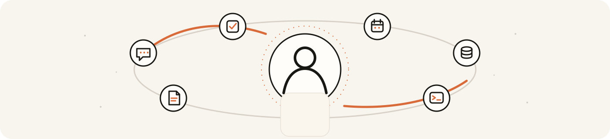

<picture>
  <source media="(prefers-color-scheme: dark)" srcset="assets/readme/banner-dark.svg">
  <source media="(prefers-color-scheme: light)" srcset="assets/readme/banner-light.svg">
  
</picture>

<div align="center">

<!--
README.md is the canonical authored English surface.
A localized README.it.md can be derived after copy freeze with freshness tracking.
-->

# Muffin

### A human-first personal agent built to make you more capable, not more dependent.

One agent that keeps the thread across time, models, tools and surfaces — while its memory, work and authority remain under the owner's control.

**One agent · your continuity · your rules**

[Why Muffin](docs/THESIS.md) · [Vision](docs/VISION.md) · [Cognitive design](docs/COGNITIVE-DESIGN.md) · [Architecture](docs/ARCHITECTURE.md) · [Security](docs/SECURITY.md)

<sub><strong>DEVELOPER PREVIEW · PRE-DAY-1</strong> — real runtime, still being hardened for daily life.</sub>

</div>

---

> **Models change. Devices change. Apps change. Muffin should not have to become someone else every time they do.**

## What is Muffin?

Most AI products begin with a conversation. **Muffin begins with the person across time.**

The goal is one continuous personal agent whose history, unfinished work, point of view and authority survive new chats, model changes, process restarts and new interfaces. CLI, Telegram, future desktop, voice or a wearable are ports onto the same Muffin — not separate assistants.

Memory, tools and self-hosting are increasingly baseline agent features. Muffin's harder bet is **sovereign, portable continuity**: preserving not only facts, but who said what, what changed, what is still owed, what may already have happened, and what the agent is actually allowed to do.

**It already exists as a working system:** resident runtime, CLI, durable memory/work, tools, policy boundaries, Telegram and scheduling. The current job is making that system trustworthy enough for the owner to live inside it for 14 consecutive days.

## Do · Understand · Be present

| **DO** | **UNDERSTAND** | **BE PRESENT** |
|---|---|---|
| Carry real work through instead of stopping at an answer. | Build context without turning every source into “you said this.” | Keep commitments and context alive across sessions, waits, restarts and time. |

An executor with no continuity is a tool. A memory that cannot act is a notebook. An assistant whose obligations disappear with the session is not continuous.

## Built around the human

Muffin is not trying to simulate a human brain or optimise away human judgement.

| **You** | **Muffin** |
|---|---|
| goals, values, judgement, changing your mind, taking over | continuity, remembering commitments, tracking change, comparison, follow-through, delegated action |

The working hypothesis is **complementarity**: use the machine to carry what machines can carry well, while the person remains able to understand, correct, interrupt and decide.

Human + AI is not automatically better. Muffin has to earn that claim in real use. A mechanism that feels clever but does not make the owner more capable loses its right to stay.

## Some unusual ideas we're testing

These are **ideas, not scientific superpowers**. External cognitive/neuroscience grounding and evidence that a Muffin implementation is actually useful are tracked separately.

| | |
|---|---|
| **Prediction → outcome → Δ** `UNTESTED`<br>Can an explicit prediction become useful learning when reality disagrees? | **Silence can carry signal** `EXPERIMENT`<br>A change in what the owner stops mentioning may matter. It still does not tell Muffin *why*. |
| **Importance ≠ frequency** `EXPERIMENT`<br>Repeated is not automatically important; rare is not automatically noise. | **Forgetting can help** `UNTESTED`<br>Discard processing cruft without casually discarding the continuity humans need help preserving. |
| **Timing is part of intelligence** `EXPERIMENT`<br>A relevant observation at the wrong moment is still a bad intervention. | **Understanding ≠ power** `COMMITMENT`<br>Knowing the owner better grants Muffin no additional authority by itself. |

Legacy Muffin already provided negative evidence: noticing that a topic had disappeared did not mean it understood the context, and heartbeat-style prompts could become noise. **A signal is not understanding. Understanding is not permission.**

[Cognitive hypotheses, evidence levels and kill criteria →](docs/COGNITIVE-DESIGN.md)

## One agent across change

```text
          models change       surfaces change       machines change
                \                   |                    /
                 \                  |                   /
                  └─────────────  MUFFIN  ─────────────┘
                                one identity
                                     |
                    ┌────────────────┼────────────────┐
                 evidence         unfinished        authority
                 + beliefs            work           + effects
```

The process is replaceable. The provider is replaceable. The interface is replaceable. **The continuity-bearing meaning is not supposed to reset with them.**

## What it should feel like

Until dogfood gives us better real examples, these are labelled by maturity instead of pretending every behaviour already ships perfectly.

| | Muffin moment |
|---|---|
| `CURRENT` **Provenance** | “That came from someone else. You didn't say it.” |
| `TARGET` **Follow-through** | “I said I'd keep following this. I'm still waiting on the dependency.” |
| `CURRENT` **Authority** | “I understand what you probably want. That still doesn't give me permission to send it.” |
| `EXPERIMENT` **Presence** | Sometimes nothing happens, because Muffin did not have enough reason to interrupt. |

Real dogfood moments should progressively replace conceptual examples here.

## What exists today

Muffin is a working runtime under **DAY-1 hardening**, not a general-release personal agent yet.

| Area | State |
|---|---|
| Runtime + CLI | **Working** |
| Durable memory + provenance | **Working / hardening** |
| Durable work, waits + recovery | **Working / hardening** |
| Policy, sandbox + secret boundary | **Working / hardening** |
| Telegram + scheduling | **Working / hardening** |
| Cognitive/proactive behaviour | **Experimental** |
| Consumer-grade onboarding | **Not yet** |
| Community extension catalog | **Post-DAY-1 direction** |

The detailed Gate moves too quickly to duplicate here. [Current DAY-1 inventory →](docs/blueprint/M5-BIS.md)

## Try Muffin — developer preview

The install path is still developer-grade. Public onboarding is meant to become much simpler; **self-hosted should describe ownership, not an installation punishment.**

Requires Node.js 22+ and a supported model provider.

```bash
git clone https://github.com/GiustoPiedimonte/muffin-agent.git
cd muffin-agent
./install.sh

muffin init
muffin
muffin doctor
```

<details>
<summary><strong>Why is the repository called <code>muffin-agent</code>?</strong></summary>

The product, identity and normal command are **Muffin**. The repository/package slug carries `-agent` because the bare npm name is unavailable and because the rebuild had to coexist with its predecessor locally. Packaging is not product identity.

</details>

## Go deeper

<details>
<summary><strong>Architecture — evidence, beliefs, work, effects and authority</strong></summary>

Muffin separates persistent meaning into five planes:

- **Evidence** — what actually entered or happened;
- **Beliefs** — what Muffin currently thinks is true;
- **Work** — what is still owed, waiting, due or resumable;
- **Effects** — what Muffin intended to do and what may have happened in the world;
- **Authority** — which transitions Muffin is allowed to perform.

That separation keeps inference from becoming evidence, reasoning from becoming a claimed real-world effect, and familiarity from becoming permission.

[Architecture →](docs/ARCHITECTURE.md)

</details>

<details>
<summary><strong>Security — meaning is not authority</strong></summary>

The model can interpret and propose. It does not grant itself authority.

Known secret values are designed to stay outside general model/transcript/tool traffic. A configured remote model provider is treated as an explicit egress boundary. Better understanding of the owner does not silently increase permissions.

[Security →](docs/SECURITY.md)

</details>

<details>
<summary><strong>Cognitive design — hypotheses that are allowed to die</strong></summary>

Cognitive science and neuroscience are prior art when they expose a useful problem or trade-off. The software interpretation must still beat a sensible simpler baseline in real use.

`SHIPPED` is deliberately not an evidence status. Some legacy mechanisms have already been rejected.

[Cognitive design →](docs/COGNITIVE-DESIGN.md)

</details>

<details>
<summary><strong>Extensions — install capabilities, not permanent core bloat</strong></summary>

The intended model separates:

```text
package     what you install
capability  each authority-bearing thing it can do
grant       what you currently permit it to do
```

Gmail, browser control, Home Assistant, privacy transforms and future surfaces should live around a narrow continuity/authority core.

> **What you do not install should not exist in your Muffin.**

[Extension direction →](docs/EXTENSIONS.md)

</details>

## Road to open source

```text
owner DAY-1  →  14 days real use  →  trusted alpha  →  public alpha  →  community breadth
```

The dogfood period is meant to expose what actually forces the owner back to another agent or direct interface, what Muffin forgets, where it interrupts badly, and which supposedly clever mechanisms do not help.

> **Which mechanism made the owner more capable — and which one merely made Muffin feel more clever?**

[Open-source strategy →](docs/OPEN-SOURCE-STRATEGY.md) · [Public narrative →](docs/PUBLIC-NARRATIVE.md)

---

<div align="center">

**One agent. A life in context. Human in control.**

</div>
